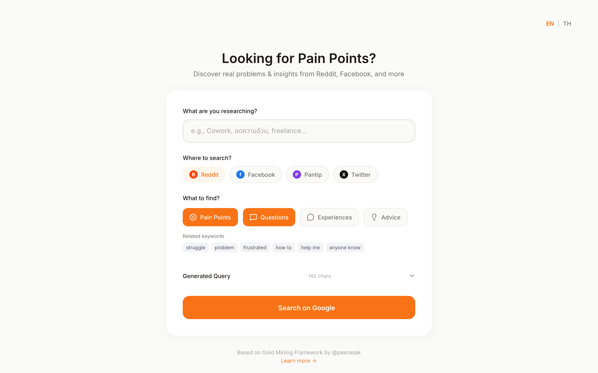

# Looking for Pain Points?

A search query generator tool for discovering real problems, insights, and discussions from social platforms like Reddit, Facebook, Pantip, and Twitter.

**Live Demo:** [probsearch.peerasak.com](https://probsearch.peerasak.com)

## What is this?

This tool helps entrepreneurs, researchers, and product builders find genuine pain points and user insights by generating advanced Google search queries. Instead of manually crafting complex search operators, simply enter your topic and select what you're looking for.

## Features

- **Multi-language Support** - Switch between English and Thai
- **Platform Selection** - Search on Reddit, Facebook, Pantip, or Twitter
- **Intent Filters** - Find specific types of content:
  - Pain Points (problems, frustrations, struggles)
  - Questions (how-to, help requests)
  - Experiences (personal stories, opinions)
  - Recommendations (advice, suggestions)
- **Smart Query Generation** - Automatically builds Google search queries using `site:`, `intext:`, and `inurl:` operators
- **Related Keywords** - Shows relevant keywords based on your selection

## How to Use

1. Open `index.html` in your browser
2. Enter a topic you want to research (e.g., "coworking", "weight loss", "freelancing")
3. Select which platform to search
4. Choose what type of content you're looking for
5. Click "Search on Google" to see results

## Use Cases

- **Market Research** - Discover what problems people face in your target market
- **Product Ideas** - Find unmet needs and pain points to solve
- **Content Creation** - Understand what questions people are asking
- **Competitive Analysis** - See what users complain about with existing solutions

## Technical Details

- Pure HTML/CSS/JavaScript (no build step required)
- Tailwind CSS via CDN
- Responsive design
- Works entirely client-side (no backend needed)

## License

MIT

---

Made with ❤️ by [@tonunsa](https://x.com/tonunsa)
